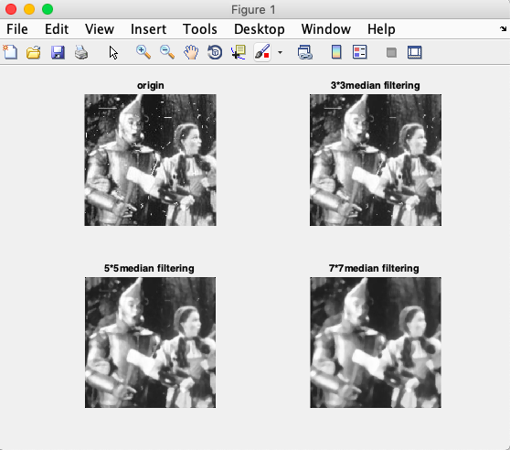

# 数字图像处理第四次作业
### 自动化63
### 杨卓
### 2160504078
1. 空域低通滤波器：分别用高斯滤波器和中值滤波器去平滑测试图像test1和2，模板大小分别是3x3 ， 5x5 ，7x7； 分析各自优缺点；\*\*
	1. 问题分析  
		&emsp;&emsp;平滑线性空间滤波器的输出是包含在滤波器模板邻域内的像素的简单平均值。它使用滤波器模板确定的邻域内像素的平均灰度值代替图像中每个像素的值，这种处理的结果降低了图像灰度的尖锐变化。
	2. 具体实现  
		&emsp;&emsp;利用imread函数读入图片，之后调用matlab中medfilt2函数进行中植滤波，调用fspecial函数生成高斯滤波器进行滤波。
	3. 处理结果
**中值滤波器**

**高斯滤波器**

4. 结果分析  
	&emsp;&emsp;可以观察到，当大小为3x3时，整幅图像中有轻微的模糊，但正如所希望的那样，当图像细节与滤波器模板近似相同时，图像中的一些细节影响较大，与其他部分比起来，要更模糊一些。大小为5x5和7x7时的结果基本类似，但模糊程度稍微有所增加。和中值滤波器比起来，高斯滤波器的平滑效果更差一些。
	5. 代码实现
	[i,map]=imread('test1.pgm','pgm');
	i1=medfilt2(i,[3 3]);
	i2=medfilt2(i,[5 5]);
	i3=medfilt2(i,[7 7]);
	h=fspecial('gaussian',[3 3],1);
	t1=imfilter(i,h,'conv');
	h1=fspecial('gaussian',[5 5],1);
	t2=imfilter(i,h1,'conv');
	h2=fspecial('gaussian',[7 7],1);
	t3=imfilter(i,h2,'conv');
	figure(1)
	subplot(221)
	imshow(i,map);
	title('origin');
	subplot(222)
	imshow(i1,map);
	title('3*3median filtering');
	subplot(223)
	imshow(i2,map);
	title('5*5median filtering ')
	subplot(224)
	imshow(i3,map);
	title('7*7median filtering ')
	
	figure(2)
	subplot(221)
	imshow(i,map);
	title('origin');
	subplot(222)
	imshow(t1,map);
	title('3*3gaussian filtering');
	subplot(223)
	imshow(t2,map);
	title('5*5gaussian filtering')
	subplot(224)
	imshow(t3,map);
	title('7*7gaussian filtering ')
2. 利用固定方差 sigma=1.5产生高斯滤波器. 附件有产生高斯滤波器的方法； 分析各自优缺点；
	1. 处理结果

2. 结果分析  
	&emsp;&emsp;从处理的结果来看，图像的平滑效果较为明显，且随着窗口的大小增大而变得模糊。和test2比起来,test1的平滑效果更好，这可能是由于test1边缘更加明显造成的。
	3. 代码实现
	[i,map]=imread('test1.pgm','pgm');
	h=fspecial('gaussian',[3 3],1.5);
	t1=imfilter(i,h,'conv');
	figure(1)
	subplot(121)
	imshow(i,map);
	title('origin');
	subplot(122)
	imshow(t1,map);
	title('3*3 sigma=1.5gaussian filtering');
3. 利用高通滤波器滤波测试图像test3,4：包括unsharp masking, Sobel edge detector, and Laplace edge detection；Canny algorithm.分析各自优缺点；
	1.  处理结果
  

2. 结果分析  
	&emsp;&emsp;四种处理都得到了边缘更加清晰的图像，与预期的效果相符，但反锐化掩模处理同时也引进了一些不希望看到的噪声，索贝尔算子并没有见图像边缘完全分离出来，拉普拉斯的改善效果则较差一点，canny处理效果较好。 
	3. 代码实现
	[i,map]=imread('test3_corrupt.pgm','pgm');
	h=fspecial('unsharp');
	t1=imfilter(i,h);
	figure(1)
	subplot(121)
	imshow(i,map);
	title('origin');
	subplot(122)
	imshow(t1,map);
	title(' unsharp');
	i2=edge(i,'sobel');
	figure(2)
	subplot(121)
	imshow(i,map);
	title('origin');
	subplot(122)
	imshow(i2,map);
	title('sobel');
	sourcePic=imread('test3_corrupt.pgm');
	grayPic=mat2gray(sourcePic);'' [m,n]=size(grayPic);
	newGrayPic=grayPic;
	LaplacianNum=0;
	LaplacianThreshold=0.2;
	for j=2:m-1 
	    for k=2:n-1
	        LaplacianNum=abs(4*grayPic(j,k)-grayPic(j-1,k)-grayPic(j+1,k)-grayPic(j,k+1)-grayPic(j,k-1));
	        if(LaplacianNum > LaplacianThreshold)
	            newGrayPic(j,k)=255;
	        else
	            newGrayPic(j,k)=0;
	        end
	    end
	end
	figure(3)
	subplot(121)
	imshow(i,map);
	title('origin');
	subplot(122)
	imshow(newGrayPic);
	i4=edge(i,'canny');
	figure(4)
	subplot(121)
	imshow(i,map);
	title('origin');
	subplot(122)
	imshow(i4);
	title('canny edge detection');

 
 

  